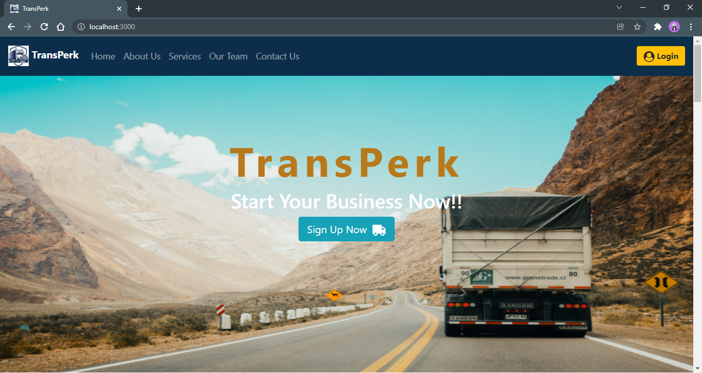

# TransPerk

Transperk is an online Transport Management System, it is a platform that connects customers and transport service vendors where customers can reach the available vendors in a particular location and vendors can use it to get the orders from customers and expand the business.

It maintains all the information about records of the orders requested by different customers as well as provides all the important information to customers like order tracking, vendor details, and other related information, keeping all these requirements under consideration.

## Home Page

## Technologies Used

* Spring Boot: designed a layered architecture with java, Controller layer for REST endpoints, Service layer for business logic, spring data JPA is used for Data access layer, etc.
* React: for a User Interface in the frontend.
* MySQL Database: for storing records.

## Run The Project

* To run the transperk-backend project, the minimum requirement is java 8, Eclipse-sts, or IntelliJ, and make sure MySQL is installed on your PC.
   * Import file as a maven project and run as Spring Boot Application
   * Project will run on port: 8080 
* For transperk-react-app, Node.js must be installed on your PC
    * `npm install` to download node_modeules dependencies folder.
    * `npm start` to run the react app.
* Done 😊

#### Thank You